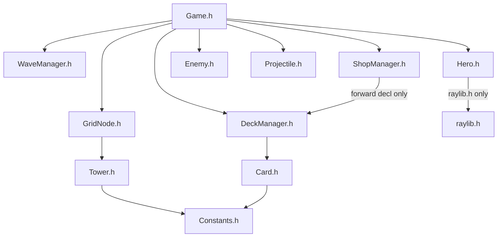

# Phase 1 Walkthrough: Header-Only Architecture for Gameplay Overhaul

## Files Created / Modified

### [NEW] [Hero.h](file:///d:/RADIT%20Files/code/gAMEJAME/src/Hero.h)
Replaces the old `DrawBase()` concept. The Hero is a proper entity at the end of the path with:
- `currentHP` / `maxHP` — replaces the old `playerHealth` int
- Ultimate ability state machine: `ultCooldownTimer`, `ultActiveTimer`, `ultDamage`, `ultRadius`
- Own `Draw()` and `Update()` loop
- **Zero dependencies** on other game classes (leaf header)

---

### [NEW] [ShopManager.h](file:///d:/RADIT%20Files/code/gAMEJAME/src/ShopManager.h)
- `ShopItem` struct: wraps a `CardDef` + `price` + `sold` flag
- Generates random T2/T3 stock via `GenerateStock()`
- `MeetsPrerequisite()` — static method enforcing the tier-dependency rule (T2 needs T1, T3 needs T2)
- `ShouldOpenShop(waveIndex)` — checks `waveIndex % 3 == 2` (after waves 3, 6, 9)
- Capacity upgrade slot: `capacityUpgradeSold`, costs `$150`
- **Forward-declares** `DeckManager` — no `#include`, no circular dependency

---

### [MODIFY] [DeckManager.h](file:///d:/RADIT%20Files/code/gAMEJAME/src/DeckManager.h)

render_diffs(file:///d:/RADIT%20Files/code/gAMEJAME/src/DeckManager.h)

Key additions:
- `maxHandSize` starts at `3` (was hardcoded `HAND_SIZE = 5`)
- `STARTING_HAND_CAP = 3`, `MAX_HAND_CAP = 5` — static constexpr limits
- `std::set<int> ownedTiers` — tracks `(type*10 + tier)` for dependency checks
- `IsTierAllowedInDraft(tier)` — returns `true` only for T1
- `AddCardToHand()` / `UpgradeCapacity()` — shop integration
- `OwnsType()` / `RegisterOwnership()` — ownership queries

---

### [MODIFY] [Game.h](file:///d:/RADIT%20Files/code/gAMEJAME/src/Game.h)

render_diffs(file:///d:/RADIT%20Files/code/gAMEJAME/src/Game.h)

Key changes:
- Includes `ShopManager.h` and `Hero.h`
- `playerHealth` is now a `int&` reference alias to `hero.currentHP`
- Added `ShopManager shop` and `Hero hero` members
- New methods: `UpdateShop()`, `DrawShop()`, `CheckWaveEndShop()`
- Removed `DrawBase()` — replaced by `hero.Draw()`

---

### [MODIFY] [Constants.h](file:///d:/RADIT%20Files/code/gAMEJAME/src/Constants.h)

```diff
-enum class GameState  { DRAFTING, PLAYING, GAME_OVER, VICTORY };
+enum class GameState  { DRAFTING, PLAYING, SHOP, GAME_OVER, VICTORY };
```

## Dependency Graph (No Cycles)



> [!IMPORTANT]
> These headers will **not compile** yet — the `.cpp` files still reference old signatures (e.g. `HAND_SIZE` in `DeckManager.cpp`, `DrawBase()` in `Game.cpp`). That's intentional: Phase 2 is the implementation pass.
